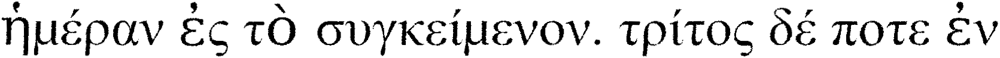

# Kalchas : A greek polytonic OCR library  


Kalchas is a greek polytonic OCR library impemented in pytorch. 

This inital release is largely based on the work of Simistira et al. [Recognition of historical Greek polytonic scripts using LSTM networks](https://ieeexplore.ieee.org/abstract/document/7333865/), 
where the LSTM architecture has been replaced by a modified version of the Convolutional Recurrent Neural Network (CRNN) impemented in [crnn-pytorch](https://github.com/GitYCC/crnn-pytorch) . 

The Character Error Rate (CER) in the test set from the original dataset is near 1% and the model(s) generally perform very well in out of sample, reasonably segmented documents with similar fonts. 

New models trained on additonal datasets are scheduled to be released in the following weeks/months. 


### Installation 

TODO


### Limitations 

This initial release only supports OCR in segmented horizontal lines. Page layout analysis and end-to-end recognition is not supported in this version.

For basic segmentation the [Kraken](https://github.com/mittagessen/kraken) OCR library can be used. For image deskewing, also refer to the [wand-py](https://docs.wand-py.org/) (ImageMagick  bindings) library. 


###  Example usage: 


 


```python
from PIL import Image
from kalchas.ocr import list_available_models, load_ocr_model


models = list_available_models() # get all available models: ['Kalchas', 'Polyton-DB']
model = load_ocr_model('Kalchas') 


# load image 
image_path = "images/010000.bin.png" 
image  = Image.open(image_path).convert('L')
 
text = model.ocr([image]) #  output: ['ἡμέραν ἐς τὸ συγκείμενον. τρίτος δέ ποτε ἐν']

``` 


A more detailed full page OCR example using Kalhas and Kraken can be found [here](demo.ipynb)


### Citing


TODO: Citing

